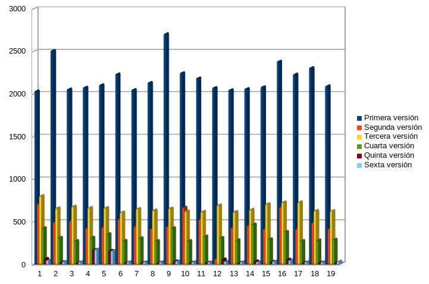

# Peso Hamming

**Importante**: El eje de ordenadas de las distintas gráficas corresponden a la i-ésima ejecución del programa, mientras que el de coordenadas corresponde al tiempo en microsegundos.

#### Ejecución del programa con el parámetro de optimización `-O0`:

 - *Media de la primera versión:* 6138 microsegundos.
 - *Media de la segunda versión:* 2296 microsegundos.
 - *Media de la tercera versión:* 695 microsegundos.
 - *Media de la cuarta versión:* 1509 microsegundos.
 - *Media de la quinta versión:* 64 microsegundos.
 - *Media de la sexta versión:* 210 microsegundos.

#### Ejecución del programa con el parámetro de optimización `-O1`:

 - *Media de la primera versión:* 2194 microsegundos.
 - *Media de la segunda versión:* 475 microsegundos.
 - *Media de la tercera versión:* 670 microsegundos.
 - *Media de la cuarta versión:* 330 microsegundos.
 - *Media de la quinta versión:* 50 microsegundos.
 - *Media de la sexta versión:* 49 microsegundos.

#### Ejecución del programa con el parámetro de optimización `-O2`:

 - *Media de la primera versión:* 2033 microsegundos.
 - *Media de la segunda versión:* 486 microsegundos.
 - *Media de la tercera versión:* 599 microsegundos.
 - *Media de la cuarta versión:* 429 microsegundos.
 - *Media de la quinta versión:* 65 microsegundos.
 - *Media de la sexta versión:* 43 microsegundos.

Podemos observar que, en general, se forman dos bloques: Uno conformado por las cuatro primeras versiones y otro por las dos últimas. El segundo bloque es mucho más rápido que el primero, aunque se observa que la segunda versión al optimizarla se convierte en una alternativa mejor a la segunda.